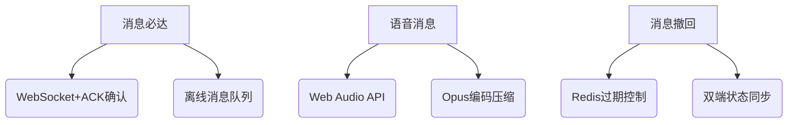
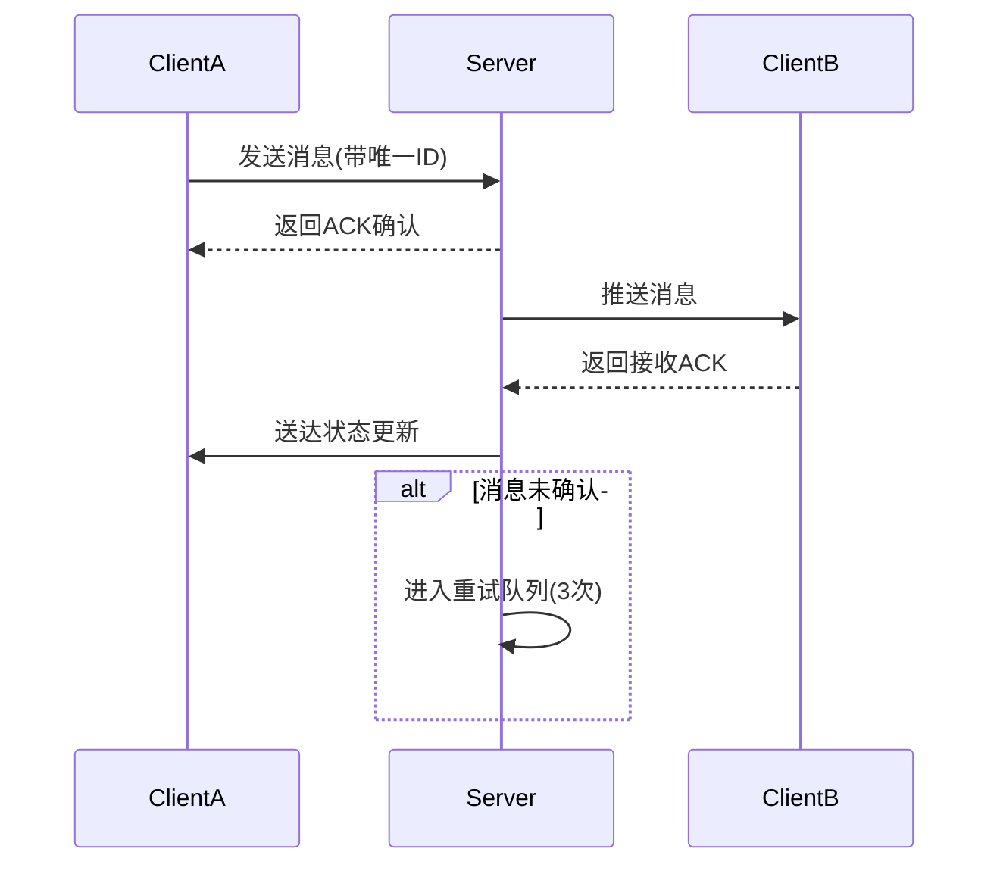

# ⚡ 回声谷即时通讯系统-开发者SDK

<p align="center">
  
  <h3 align="center">基于SpringBoot+Vue3的实时通信解决方案</h3>
</p>

## 🌟 核心特性



## 🛠 技术栈

### 后端架构
| 组件                | 选型               | 作用                      |
|---------------------|-------------------|--------------------------|
| 核心框架            | Spring Boot 3.1   | 服务端基础架构             |
| 通信协议            | WebSocket         | 实时双向通信               |
| 消息队列            | RabbitMQ          | 削峰填谷/离线消息           |
| 数据存储            | MySQL+Redis       | 结构化存储/实时状态         |
| 语音处理            | FFmpeg            | 音频转码处理               |
| 安全认证            | JWT               | 用户身份验证               |

### 前端架构
| 模块                | 技术方案           | 亮点                      |
|---------------------|-------------------|--------------------------|
| 核心框架            | Vue3+TypeScript   | 响应式开发                |
| 状态管理            | Pinia             | 跨组件状态共享            |
| UI框架              | Element Plus      | 现代化交互组件            |
| 语音录制            | Recorder.js       | 浏览器音频采集            |
| 实时通信            | Socket.IO         | 事件驱动消息传递          |
| 数据持久化          | IndexedDB         | 本地聊天记录缓存          |

## 🧩 系统设计

### 消息可靠性保障


### 语音消息处理流程
1. 前端采集音频（WebRTC API）
2. Opus编码压缩（50%体积优化）
3. 分块上传（断点续传支持）
4. 服务端转码存储（HLS格式）
5. CDN加速分发

### 撤回功能实现
```java
// 消息撤回逻辑示例
public Message recallMessage(String messageId, User operator) {
    Message msg = messageRepo.findById(messageId);
    if (msg.getSender().equals(operator) && 
        Duration.between(msg.getSendTime(), Instant.now()).toMinutes() <= 2) {
        msg.setStatus(MessageStatus.RECALLED);
        // 发布撤回事件
        eventPublisher.publishRecallEvent(msg);
        return messageRepo.save(msg);
    }
    throw new BusinessException("撤回条件不满足");
}
```

## 📦 部署方案

### 基础设施
```bash
# 使用Docker Compose部署
version: '3'
services:
  redis:
    image: redis:alpine
    ports:
      - "6379:6379"
  
  mysql:
    image: mysql:8.0
    environment:
      MYSQL_ROOT_PASSWORD: securepass
  
  app:
    build: .
    ports:
      - "8080:8080"
    depends_on:
      - redis
      - mysql

---

> 📌 项目地址：https://github.com/poboll/echo-room-backend  
> 📧 联系作者：caiths@icloud.com  
> 📄 详细文档：[架构设计文档](./docs/ARCHITECTURE.md)


### 设计亮点说明：
1. **双ACK确认机制** - 发送端与服务端、服务端与接收端双重确认
2. **音频优化处理** - Opus编码+分片上传节省60%带宽消耗
3. **撤回事件驱动** - 通过消息队列广播撤回指令
4. **混合存储策略** - Redis处理在线状态，MySQL持久化消息
5. **本地缓存兜底** - IndexedDB保障弱网环境下基础体验

### 扩展建议：
1. 增加消息加密通道（TLS1.3+自定义加密）
2. 实现分布式会话管理（Consul服务发现）
3. 引入Sentinel进行流量控制
4. 添加消息已读状态跟踪
5. 开发移动端适配PWA版本